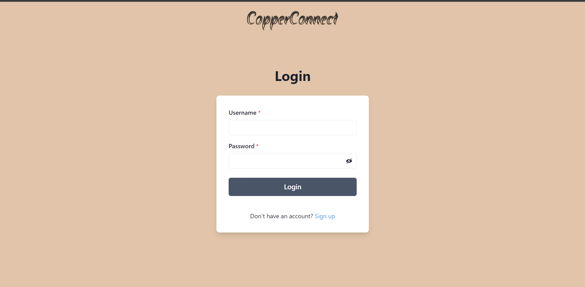
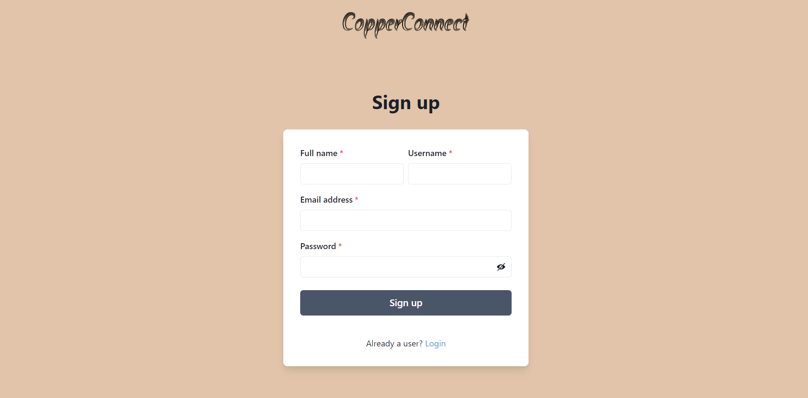
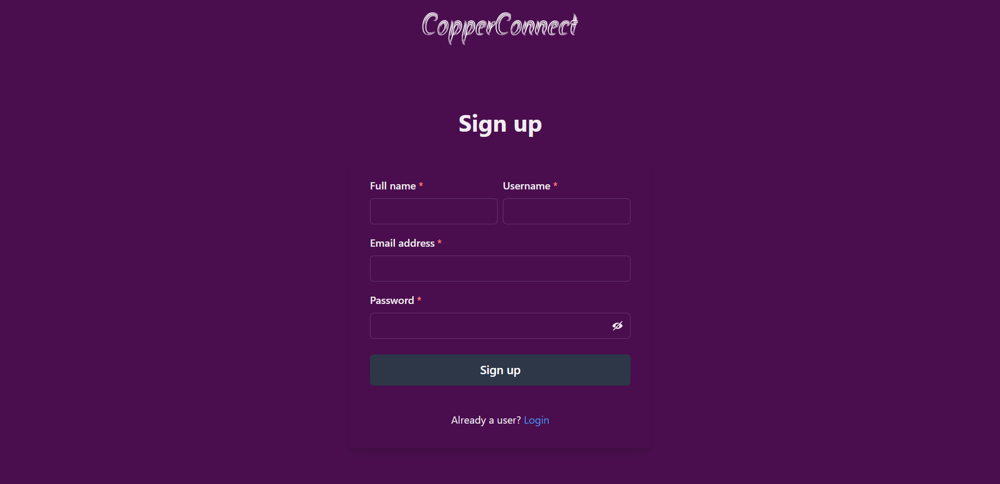
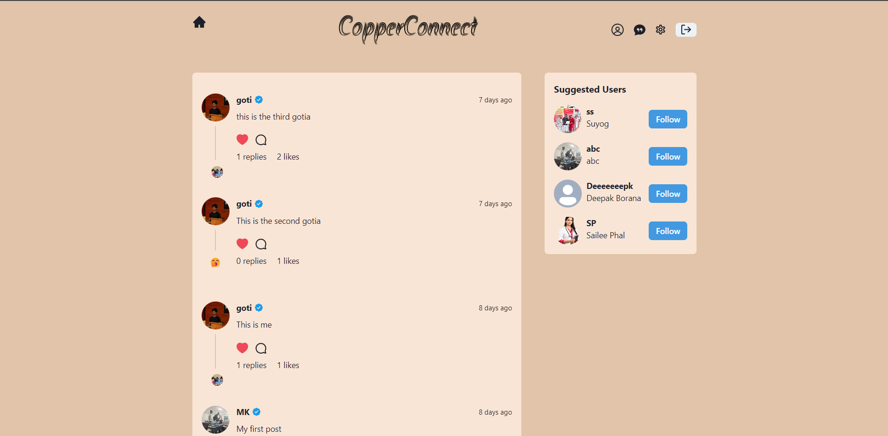
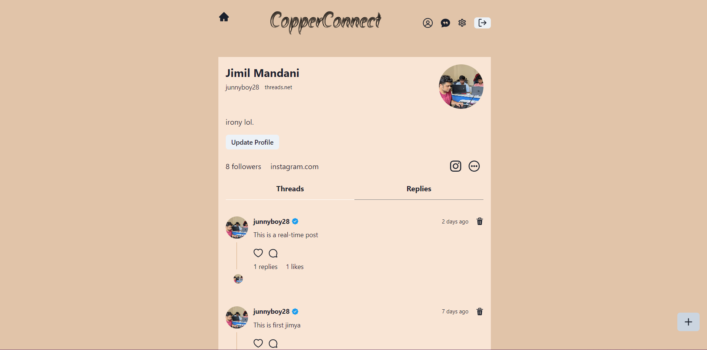
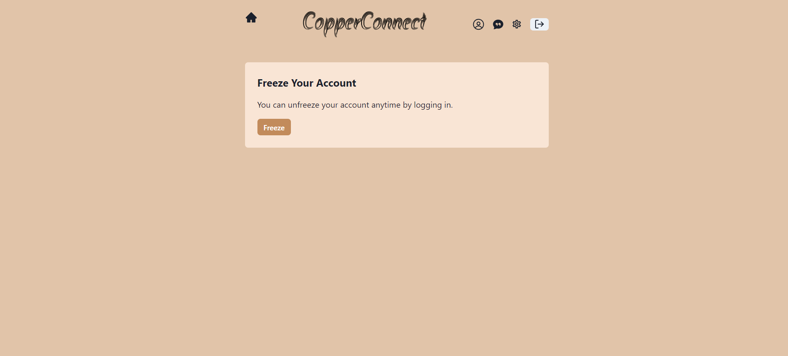
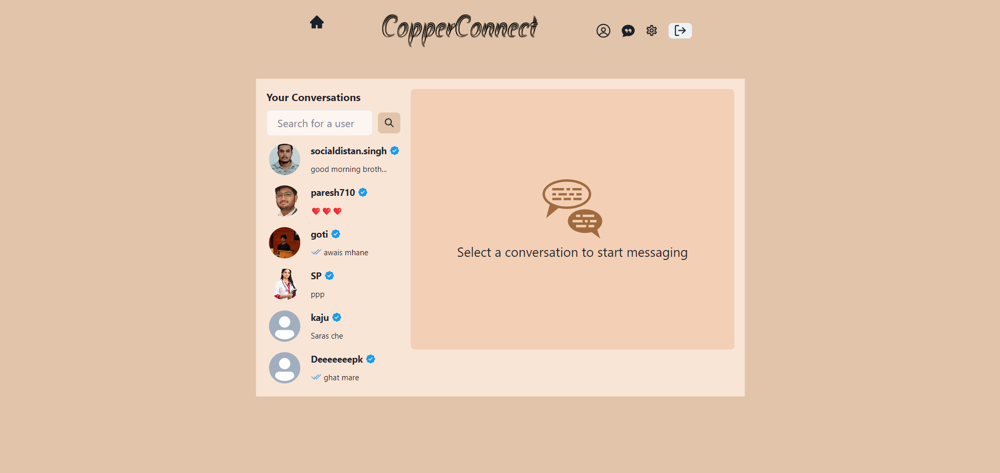
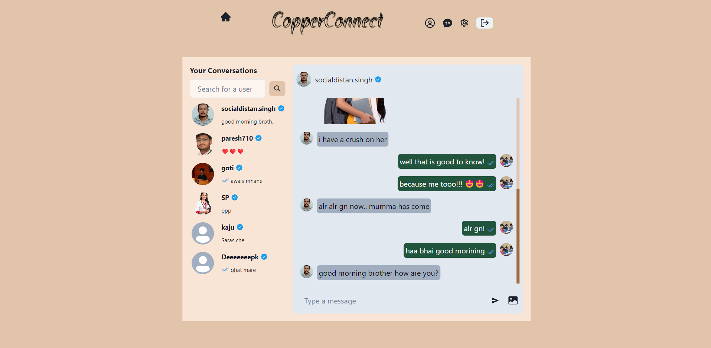

This project is a full-stack web application built using the MERN (MongoDB, Express.js, React.js, Node.js) stack. The application is divided into a frontend and a backend, each managed independently with specific configurations.

Technologies Used
Frontend
React.js: A JavaScript library for building user interfaces.
Vite: A build tool that provides a faster and leaner development experience.
Chakra UI: A simple, modular, and accessible component library for React.
Framer Motion: A library for creating animations in React.
Recoil: A state management library for React.
Socket.IO Client: For real-time, bidirectional communication between web clients and servers.
Backend
Node.js: A JavaScript runtime built on Chrome's V8 JavaScript engine.
Express.js: A minimal and flexible Node.js web application framework.
Mongoose: An Object Data Modeling (ODM) library for MongoDB and Node.js.
JWT (jsonwebtoken): A library for JSON web tokens used for user authentication.
Bcrypt.js: A library to hash passwords.
Socket.IO: A library for real-time web applications.
Cloudinary: A cloud-based service for managing images and videos.
Cron: A library to schedule tasks to be executed periodically.
Development Tools
Cross-Env: Allows you to run scripts that set and use environment variables across platforms.
Nodemon: A utility that monitors for any changes in your source and automatically restarts your server.
Scripts
Frontend
npm run dev: Starts the development server with Vite.
npm run build: Builds the project for production using Vite.
npm run lint: Runs ESLint to lint the source files.
npm run preview: Previews the production build.
Backend
npm run dev: Starts the backend server with Nodemon for development.
npm start: Starts the backend server in production mode.
npm run build: Installs dependencies and builds the frontend.

<h2>This is the Explaination</h2>

Colour change on clicking logo:

Real-time posts/likes/comments updates using socket IO and User Suggestions:

Profile Update and creation of posts:

Freezing Account Feature:

Real Time Chatting using SocketIO:

Image Support as well:

fork this repository.. and 

run: "npm run build"

and then "npm start"

Happy Hacking!
